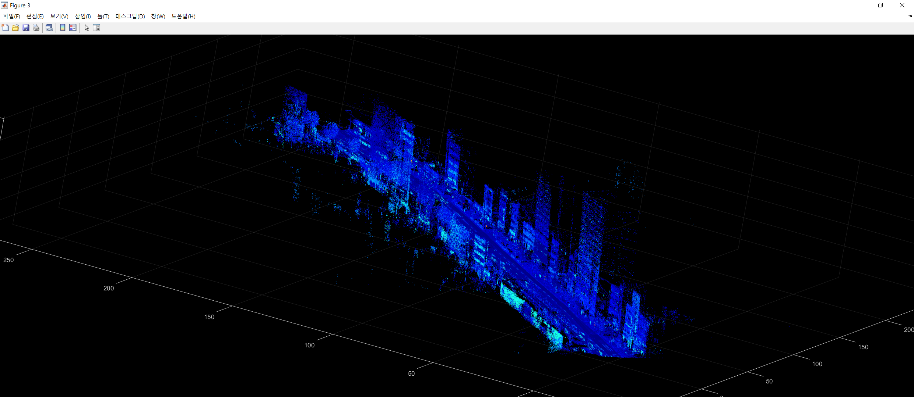

#  Velodyne georeferencing 
##  Georeferencing VLP-16 pcap with APX-18 pose data

## Data
* [Velodyne VLP-16 pcap data](https://drive.google.com/drive/folders/11MAYYT8yh1Ydfoc_mmwxt-mFJUpKXrsx?usp=sharing)
* [Pose data](https://drive.google.com/drive/folders/1zbDNGi452DZ0ElnssES-GXE0Bkjyolno?usp=sharing)

